<p align="center" style="font-size: 2px;">
    
    <br> 
    This repository contains all the information and everything you need to know about what Motoplay is, how to use it and many other details. Read this page to understand everything about Motoplay.
</p>

# What is Motoplay?

Motoplay is a project that aims to bring an on-board computer to motorcycles. The main point is that this computer must be 100% functional, running Linux, for greater flexibility, and be able to interact with the vehicle's ECU to read information of motor and vehicle, have a media player and several other functions. Basically, this computer should work as a kind of "second panel", with Touchscreen input support, on the motorcycle's handlebars, so that the rider can count on several functions within reach of just a few touches.

The project is divided into two layers, the Hardware layer and the Software layer. The Hardware layer consists of all the accessories (peripherals) that will be installed on the motorcycle and that will be used by the on-board computer, such as speakers, 5v3a USB output, camera, etc.

In the second layer, in Software, we will have the Linux operating system, which will run the "Motoplay" software in full time, which is a program that will function as the on-board computer's central hub, being the key point for the pilot's use of the computer.

Of course, there are some mandatory Hardware accessories that need to be installed on your motorcycle if you intend to use Motoplay. All of these components are listed below. After that, there are some necessary procedures to prepare the computer and install the "Motoplay" program on the computer. All of this and many other details are all documented on this page, if you want to continue learning more, just keep reading!

[ INSERT-IMAGE ]

> [!WARNING]
> If you intend to use Motoplay, before we continue with this page... It is assumed that you already have prior knowledge regarding the use of the Linux System, Maintenance and Assembly of PCs, Experience With Installing Accessories on Motorcycles, and Knowledge About the OBD Interface of Vehicles. Keep in mind that if you are going to install accessories on your motorcycle, it is interesting that you already have prior knowledge and experience to do so.
> 
> You can create topics in the "Issues" tab of this repository, to ask questions, report problems or send suggestions! 🙂

# What Hardware do I need to have if I want to use Motoplay?

This topic will tell you all the Hardware you can buy to install on your motorcycle if you want to use Motoplay. Since there are many functions in Motoplay, not every function may be of interest of you, so the Hardware is divided into groups according to their functions. For each group, there is a Table below, informing you of the Hardware you need to have if you want to use the functions of the group.

Starting with the Computer group. Everything in this group is mandatory, and is necessary if you want to use Motoplay, as all the hardware in this group is directly connected to the central element of Motoplay, which is the on-board computer.

| Image                                        | Name                                  | Details                                                                                                                                                                                                                                                                                                                                                                                                                                                                                                                                                                                                                                                                                                                                                                                                                                                                                                                                                                                                                                                                                                                                                                                                                                                                                                                              | Mandatory |
| -------------------------------------------- | ------------------------------------- | ------------------------------------------------------------------------------------------------------------------------------------------------------------------------------------------------------------------------------------------------------------------------------------------------------------------------------------------------------------------------------------------------------------------------------------------------------------------------------------------------------------------------------------------------------------------------------------------------------------------------------------------------------------------------------------------------------------------------------------------------------------------------------------------------------------------------------------------------------------------------------------------------------------------------------------------------------------------------------------------------------------------------------------------------------------------------------------------------------------------------------------------------------------------------------------------------------------------------------------------------------------------------------------------------------------------------------------ | --------- |
| 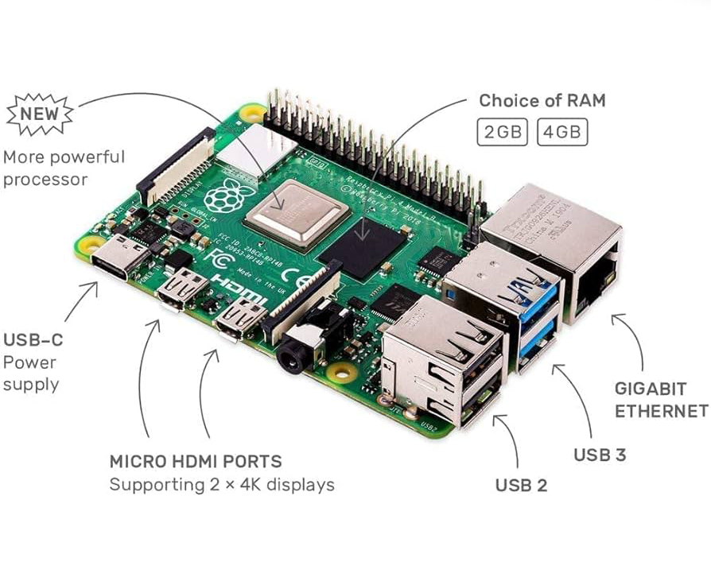     | Raspberry Pi 4 Model B (or better)    | The Raspberry Pi is the hardware we will use as a computer due to its flexibility and practicality. It is an excellent piece of hardware that comes with a great Linux/Debian distro, which is Raspbian OS, in addition to having HDMI, P2, Gigabit, USB 2.0 and USB 3.0 ports, Bluetooth adapter and Wi-Fi. It is best if your Raspberry Pi is a 64-bit model, with at least 4GB of RAM and a 1.5 Ghz Quad-Core CPU. For this reason, the Raspberry Pi 4 Model B or any other newer or higher model is recommended.                                                                                                                                                                                                                                                                                                                                                                                                                                                                                                                                                                                                                                                                                                                                                                                                                 | Yes       |
| 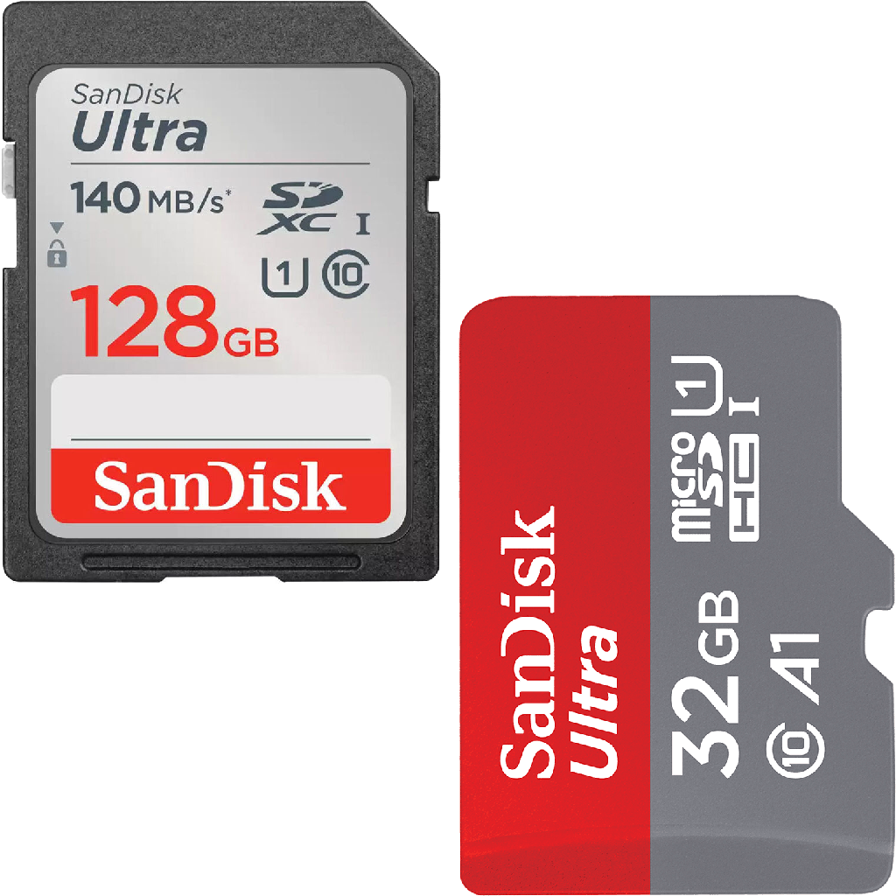    | SD Card                               | The SD card works like an SSD for the Raspberry Pi. It is where you can save the system and all the files so that the Raspberry Pi can work. For best functionality and speed, a "SanDisk Ultra" or "SanDisk Extreme Pro" SD card of 32 GB or more is recommended.                                                                                                                                                                                                                                                                                                                                                                                                                                                                                                                                                                                                                                                                                                                                                                                                                                                                                                                                                                                                                                                                   | Yes       |
| 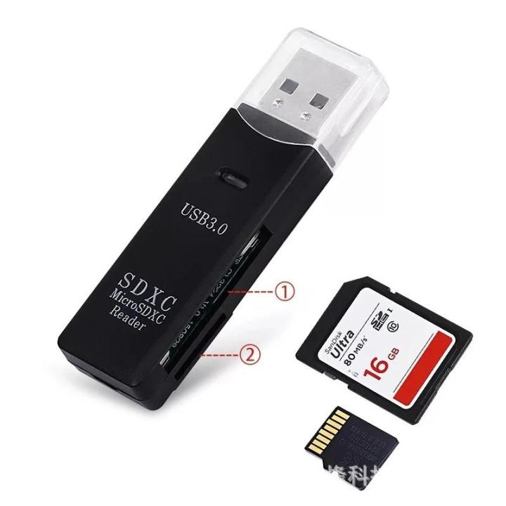 | SD Card Adapter                       | An SD Card to USB adapter will be crucial for you to be able to Read and Write data to your Raspberry Pi's SD Card using another computer. It is very useful for installing the operating system image onto the SD Card, and once everything is ready, just insert the SD Card into your Raspberry Pi. It is also very useful for using another computer to create Backup images of your SD Card. An adapter that supports USB 3.0 connection is recommended, as the USB 3.0 interface offers much higher Read and Write speeds than the USB 2.0 interface.                                                                                                                                                                                                                                                                                                                                                                                                                                                                                                                                                                                                                                                                                                                                                                          | Yes       |
| 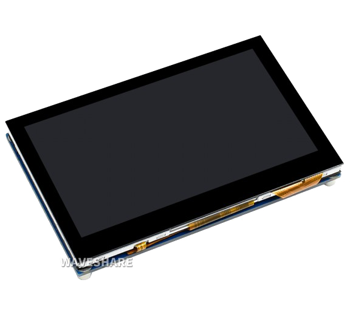     | Screen With Touchscreen Input Support | The screen is an essential component of the on-board computer that we intend to assemble for use with Motoplay, so it is crucial that the screen has Touch support as this will be the best way to interact with Motoplay. The screen must have a minimum resolution of 480x320 pixels, however, the recommended resolution is 800x480. It is desirable that the screen has at least 50hz and is IPS for a more beautiful image, however, it is not mandatory. Regarding the interface for connecting the screen to the Raspberry Pi. There are several models of portable screens on the market, and each model uses a different connection method. The most common is usually using the Raspberry Pi's HDMI ports, but for this project, the best interfaces are DSI or GPIO. Screens that are connected to the Raspberry Pi's GPIO interface usually work well, but they usually have lower refresh rates and only turn on when the operating system has already started. Screens connected using the DSI interface are the most recommended for this project, as they usually have higher refresh rates and quality, in addition to behaving very similarly to HDMI screens, turning on from the moment the Raspberry Pi is powered on, so it is possible to follow the entire boot process, up to the operating system startup. | Yes       |
| 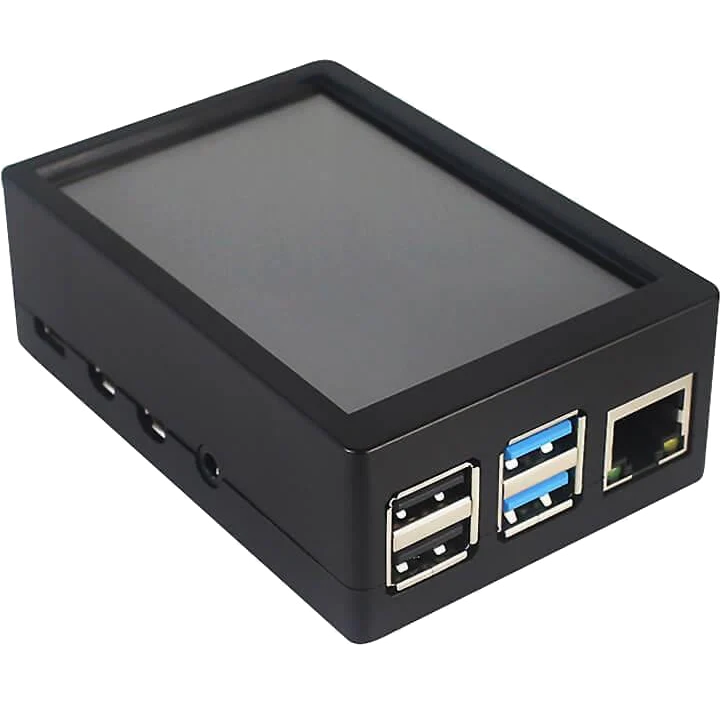       | Case                                  | The Case is a component that must be made for the version of Raspberry Pi that you have, and the Screen. There are several models of Cases on the market, in different materials, sizes and designs. It is not at all difficult to find Case + Screen Kits for a specific version of Raspberry Pi on websites such as AliExpress, for example. The Case in the image to the side, for example, was made for the "Raspberry Pi 4 Model B" that uses a 3.5' Screen that connects to the GPIO interface, like the Screen models "MHS3528" and "MPI3501".                                                                                                                                                                                                                                                                                                                                                                                                                                                                                                                                                                                                                                                                                                                                                                                | Yes       |
| 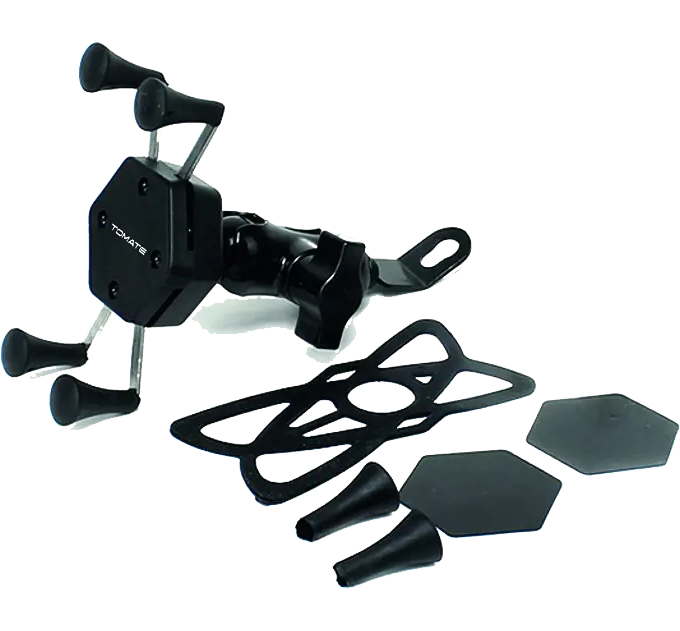    | Phone Holder                          | The Phone Holder will hold the Raspberry Pi with its Case. Generally, if the Phone Holder supports phones with a screen size of up to 7", it should be able to hold most Raspberry Pi Cases, but of course, it is always good to already have the Phone Holder on hand, to be more certain of which Case to buy. The recommended model of Phone Holder is the "claw", which is the model in the example image to the side. This model is known for holding more strongly and being easy to install. If you think the Holder will receive high vibration from the motorcycle, you can check the feasibility of installing it on the center of handlebar of your motorcycle, because the vibration may be less in the center of the handlebars, on some motorcycle models. If possible, buy a Phone Holder that does NOT have a USB Output, unless that USB Output meets the same requirements as the next hardware!                                                                                                                                                                                                                                                                                                                                                                                                                   | Yes       |
| 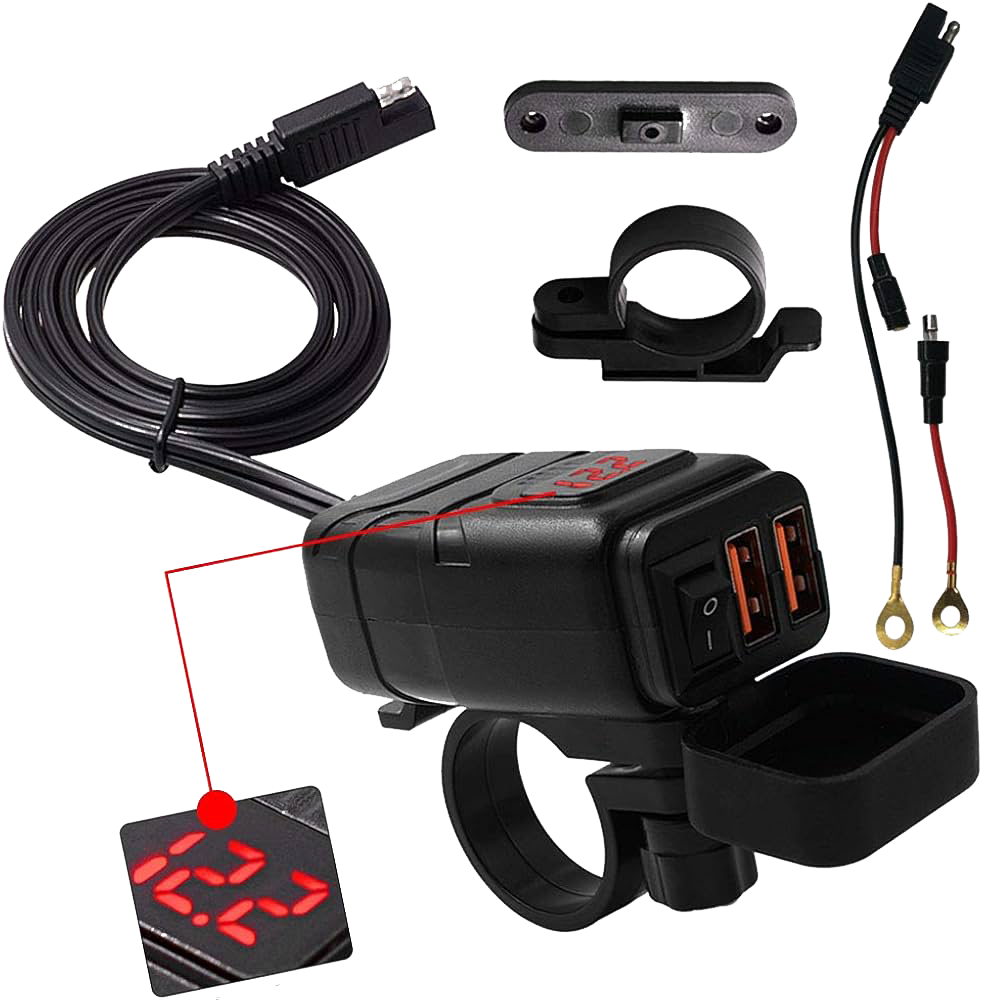 | Handlebar USB Output                  | This device works as a "socket" and must offer a USB output of at least 5 volts and 3.1 amps. Each version of the Raspberry Pi requires a specific amount of voltage and current to function. The Raspberry Pi 4, for example, requires 5 volts and 3 amps to function at its full performance. In addition, the advantage of this device is that it can be connected directly to the battery of your motorcycle, and it has a switch so that you can turn it off completely while you are not riding, to avoid problems with battery discharge. In this project, this device will be used as a socket for the Raspberry Pi. It is recommended that you purchase a version that has a fuse on the "positive" wire to avoid the risk of short circuits, and for greater safety of your vehicle. This device can also be easily found on sites like AliExpress. It is desirable that the device be water resistant. If you can find a Phone Holder that already has a USB output that meets these requirements, then this device can be dispensed with!                                                                                                                                                                                                                                                                                | Yes       |
| 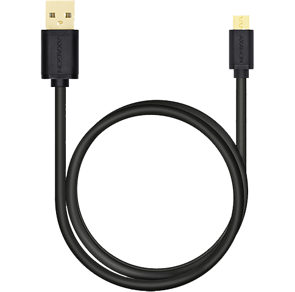  | USB Cable Turbo                       | This cable must be the same type of power connection as the Raspberry Pi and must support at least 5 volts and 3 amps, or whatever the Raspberry Pi requires. This is the cable that will be used to connect the Raspberry Pi to the USB output of the "Handlebar USB Output" to power the computer. You should measure the distance between the USB output and the USB input of the Raspberry Pi to get an idea of ​​the size of the cable you need to buy.                                                                                                                                                                                                                                                                                                                                                                                                                                                                                                                                                                                                                                                                                                                                                                                                                                                                         | Yes       |

With all this Hardware in hand, just assemble your Raspberry Pi with the Screen and Case, install the other accessories on your motorcycle and continue following this page.

Moving on to the Camera group. Nothing in this group is mandatory, and you only need to install these accessories on your motorcycle if you want to access the features that require a Camera in Motoplay.

| Image                                    | Name        | Details                                                                                                                                                                                                                                                                                                                                                                                                                                                                                                                                                                                                                                                                                                                                                                                                                                 | Mandatory |
| ---------------------------------------- | ----------- | --------------------------------------------------------------------------------------------------------------------------------------------------------------------------------------------------------------------------------------------------------------------------------------------------------------------------------------------------------------------------------------------------------------------------------------------------------------------------------------------------------------------------------------------------------------------------------------------------------------------------------------------------------------------------------------------------------------------------------------------------------------------------------------------------------------------------------------- | --------- |
| 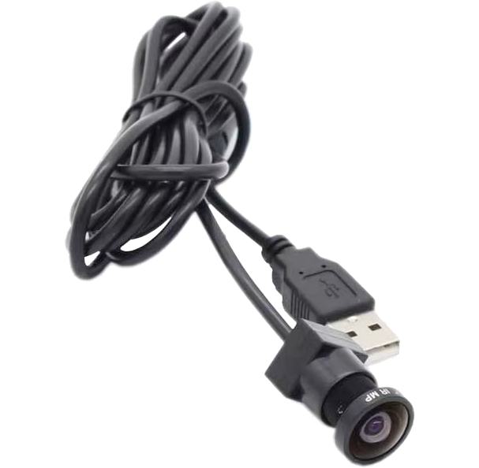 | Mini Camera | The Camera can be used for some Motoplay features, although it is a completely optional peripheral. It must be connectable to the Raspberry Pi, via USB interface. The Camera must have a USB 2.0 connector and does not need to have a Microphone. It is recommended that it be 2 MP (1080p) and have a viewing angle between 150° and 180°. Finally, it must support the UVC protocol so that it can be accessed by Motoplay on Windows (with VFW/DirectShow) and systems with Linux (with V4L2). If you want to buy one of these, you can easily find them on websites like AliExpress. To attach it to your motorcycle, in the desired location, you can use some kind of support, or simply a clamp. It is desirable that the Camera be water resistant, or at least have insulation to prevent water from infiltrating inside it. | No        |

Now, moving on to the ECU group. Nothing in this group is mandatory, however, if you want Motoplay to be able to access your motorcycle's ECU and read speed, RPM, battery voltage and other useful information, you need to install all the Hardware in this group.
> [!TIP]
> Don't worry, Motoplay doesn't change ANYTHING in your ECU, it only reads data!

| Image                                            | Name                                                             | Details                                                                                                                                                                                                                                                                                                                                                                                                                                                                                                                                                                                                                                                                                                                                                                                                                                                                                                                                                                                                                                                                                                                                                                                                                                                                                                                                                                  | Mandatory |
| ------------------------------------------------ | ---------------------------------------------------------------- | ------------------------------------------------------------------------------------------------------------------------------------------------------------------------------------------------------------------------------------------------------------------------------------------------------------------------------------------------------------------------------------------------------------------------------------------------------------------------------------------------------------------------------------------------------------------------------------------------------------------------------------------------------------------------------------------------------------------------------------------------------------------------------------------------------------------------------------------------------------------------------------------------------------------------------------------------------------------------------------------------------------------------------------------------------------------------------------------------------------------------------------------------------------------------------------------------------------------------------------------------------------------------------------------------------------------------------------------------------------------------ | --------- |
| 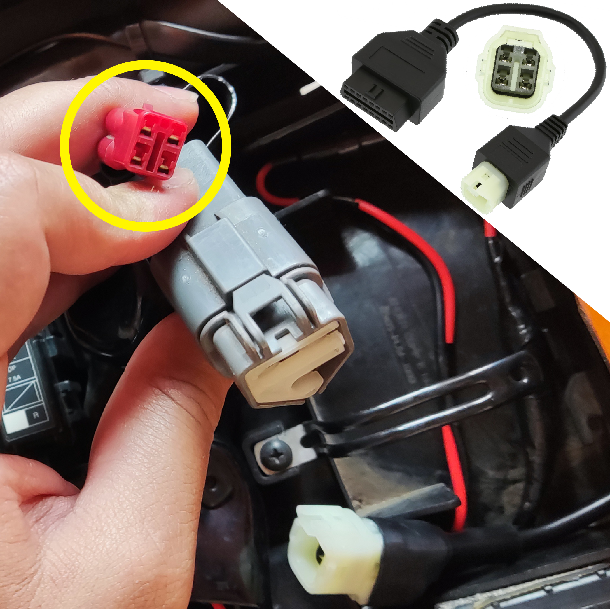    | OBD-II Adapter                                                   | In cars, the standard OBD-II female connector is always used. Nowadays, most modern motorcycles have their ECUs accessible via the OBD-II standard, however, there is no standard for OBD-II connectors like there is in cars, so each brand uses a specific connector standard. In the image to the side, you can see the Honda CB500F OBD-II connector, which is a 4-pin standard. Generally, each brand has a standard that applies to most models sold by that brand. For example, Honda uses 4-pin OBD-II connectors, Yamaha has 3- and 4-pin standards, BMW has a 10-pin standard, Harley has 4- and 6-pin standards, and the list goes on. For this reason, the easiest thing to do is to buy an adapter for the Female OBD-II standard, as shown in the upper right corner of the image to the side, but adapting it to the type of connector on your motorcycle. It is very easy to find different types of OBD-II adapters on websites like AliExpress.                                                                                                                                                                                                                                                                                                                                                                                                        | No        |
| 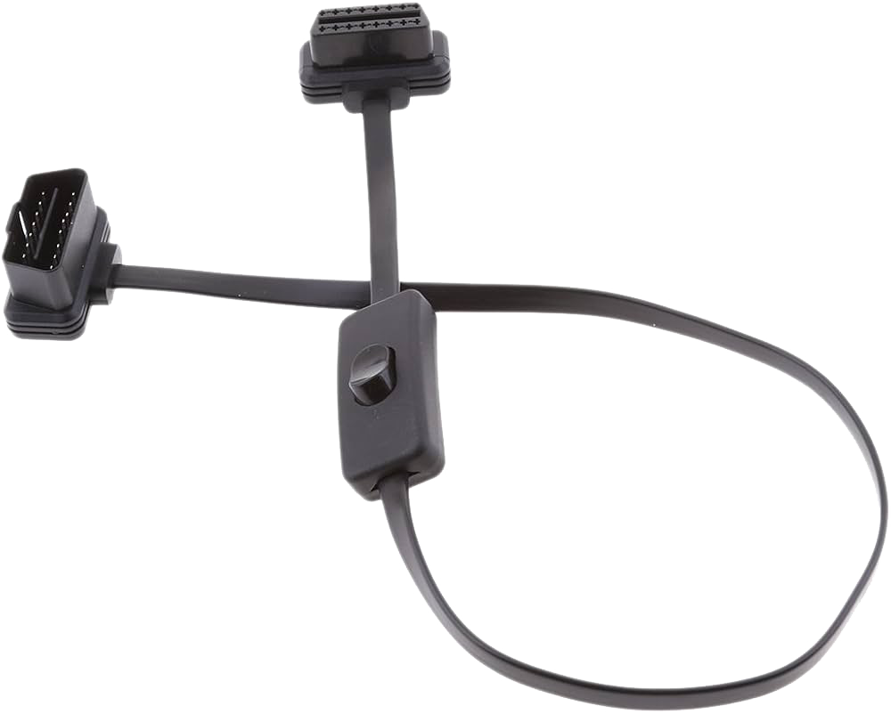   | OBD-II Extender With Switch                                      | This Extender gives you the advantage of having more freedom to decide and position the OBD-II output of your motorcycle, however, the main advantage of this Extender is its switch, which allows you to turn the output off and on quickly, which can be useful to completely turn off the OBD-II output and avoid losing charge on your motorcycle's battery while you are not riding it. Using my motorcycle as an example, I used this Extender and cable ties to position my motorcycle's OBD-II port on the outside for easy access. This Extender can be easily found on websites such as AliExpress.                                                                                                                                                                                                                                                                                                                                                                                                                                                                                                                                                                                                                                                                                                                                                            | No        |
| 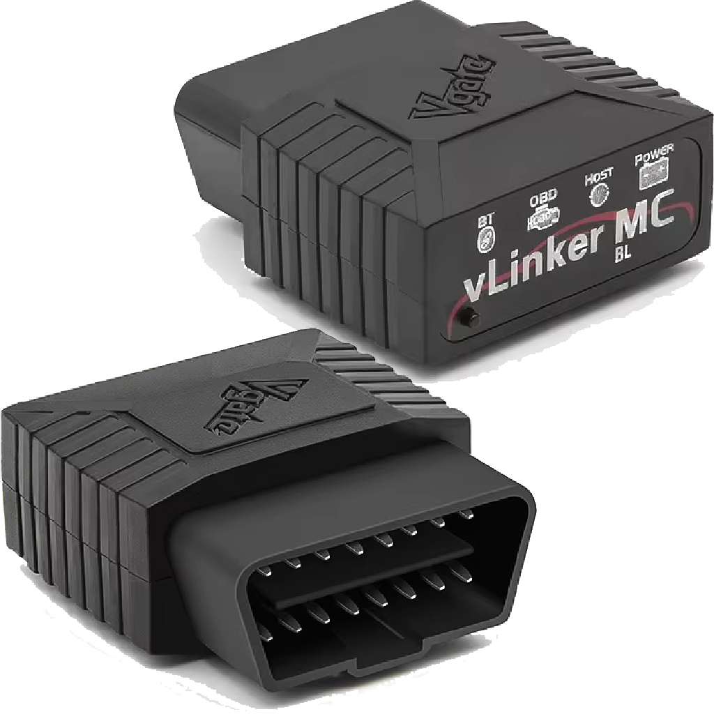 | V-Gate VLinker MC Bluetooth 3.0 or other ELM327 Bluetooth Device | The "V-Gate V-Linker MC" is an OBD-II adapter that allows access to a vehicle's ECU via the OBD standard, for any device that is connected via Bluetooth to the V-Linker MC. The V-Linker MC works like any other ELM327 adapter, which are well known among people who often use applications to access their vehicle's ECU. The V-Linker MC has a Baud Rate of 4Kbps, a Serial Buffer of 2Kb, a OBD Request Buffer of 48 Bytes, Firmware updates, supports all ELM327/ELM329 protocols, supports 15 ELM protocols and 23 STN protocols, fully supports AT and ST commands. In short, it is a durable device that can communicate quickly with the ECU. If you prefer another ELM327 device, you can use it without any problems, however, this device must have Bluetooth 3.0, specifically this version. ELM327 devices that have Bluetooth 4.0+ usually use the Bluetooth Low Energy (BLE) protocol which is a rather slow protocol that affects the ECU reading speed. Motoplay is able to connect to such devices and use them to access the vehicle's ECU, so these devices are a bit key if you want Motoplay to read your motorcycle's ECU. The Bluetooth connection type is the most recommended as it is more convenient, not requiring more cables and avoiding the problems of vibration of USB cables connected to the Raspberry Pi ports during piloting. | No        |

Finally, moving on to the Sound System group. Nothing in this group is mandatory, however, if you want Motoplay to be able to play sounds and media, you must have a Sound System installed on your motorcycle. If you want to install a Sound System, simply install all the accessories in this group.

| Image                                          | Name                                                                            | Details                                                                                                                                                                                                                                                                                                                                                                                                                                                                                                                                                                                                                                                                                                                                                                                                                                                                                                                                                                                                                                                                                                                                                                                                                                    | Mandatory |
| ---------------------------------------------- | ------------------------------------------------------------------------------- | ------------------------------------------------------------------------------------------------------------------------------------------------------------------------------------------------------------------------------------------------------------------------------------------------------------------------------------------------------------------------------------------------------------------------------------------------------------------------------------------------------------------------------------------------------------------------------------------------------------------------------------------------------------------------------------------------------------------------------------------------------------------------------------------------------------------------------------------------------------------------------------------------------------------------------------------------------------------------------------------------------------------------------------------------------------------------------------------------------------------------------------------------------------------------------------------------------------------------------------------ | --------- |
| 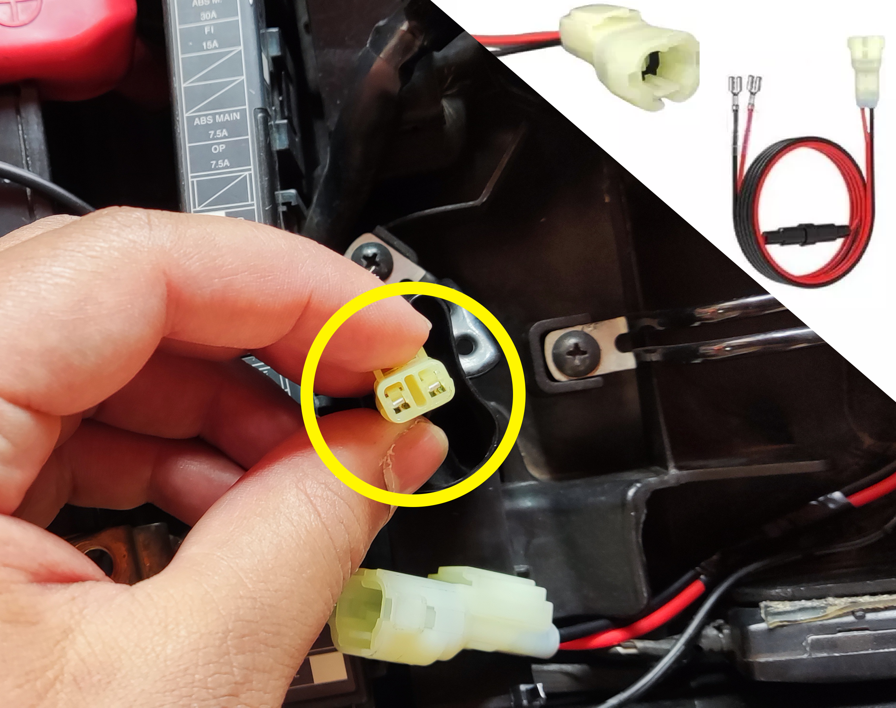   | Connector For 12v Socket After Key (May Not Be Necessary For Some Motorcycles!) | Some motorcycles have a 12v socket under the seat, available for the rider to connect accessories to. This socket only emits power if the motorcycle's ignition is on. This socket is generally the safest and most recommended way to install a Sound System on your motorcycle. Each motorcycle brand has a different shape for this connector. In the image to the side, you can see the 12v connector of the Honda CB500F. Because of this, you can buy a connector that can connect to this socket and emit 2 wires so that you can use it to connect your Sound System. If your motorcycle does not have a 12v socket like this, you can connect the Sound System to the battery, but it will always be powered. Another alternative is to connect the Sound System in parallel, with wires that only become powered after turning on the motorcycle's ignition. In this case, it is recommended that this installation only be done by someone who understands exactly which wires can be used to connect the Sound System. Of course, if your Sound System has a physical switch, then there is no problem in connecting it to the battery, as you can turn off the switch to avoid loss of charge with the motorcycle turned off. | No        |
| 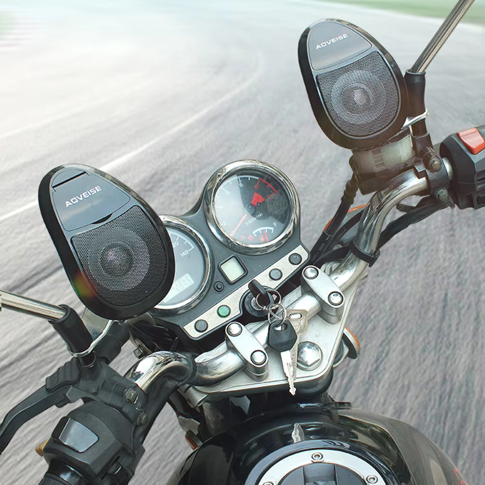 | Motorcycle Sound System                                                         | There are several Sound Systems available on websites like AliExpress, to suit all tastes and styles. It is best to choose a Sound System that supports Bluetooth connectivity to easily connect to the Raspberry Pi in the best possible way, without interference or the need for additional cables. It is a good idea to choose a Sound System that has been manufactured specifically for motorcycles, as this ensures that it will not put stress on the motorcycle's Electrical System. It is also recommended that the Sound System be positioned on the motorcycle's handlebars, so that it is possible to hear the sounds more easily while riding. It is highly recommended that the Sound System have a fuse on the positive wire, to avoid problems with short circuits and for greater safety of the Electrical System. It is also desirable that the Sound System be water resistant.                                                                                                                                                                                                                                                                                                                                        | No        |

> [!WARNING]
> If you intend to build a custom Sound System for your motorcycle, remember to take into account the capacity of the motorcycle's Electrical System, and also respect the wire and cable sections (widths), in addition to always using fuses to protect circuits. Creating a custom Sound System is at your own risk!

# Preparing the Raspberry Pi for Motoplay

Now that you have the desired/needed accessories installed on your motorcycle, and you have your Raspberry, Screen and Case already assembled, it's time to put an operating system to run on your Raspberry Pi's SD Card.

You can follow <a href="https://github.com/marcos4503/motoplay/blob/main/Additional-Material/Topics/Installing%20Raspbian%20OS%20In%20Empty%20SD%20Card/Content.txt">this guide</a> to install Raspbian OS and set it up on your Raspberry Pi. You may need the "Raspberry Pi Imager" to install the system on your Raspberry Pi. You can access <a href="https://github.com/marcos4503/motoplay/tree/main/Additional-Material/Content%20to%20Download">this link</a> to find the download for this software.

Once you have the operating system installed and configured on your Raspberry Pi, you may want to add a few finishing touches. If you want to do a few more things with your system, just read the topics below...

- <a href="https://github.com/marcos4503/motoplay/blob/main/Additional-Material/Topics/How%20To%20Check%20OS%20Release%20And%20Version.txt">How To Check OS Release And Version Installed</a>
- <a href="https://github.com/marcos4503/motoplay/blob/main/Additional-Material/Topics/Changing%20Image%20of%20Welcome%20to%20the%20Raspberry%20Pi%20Desktop%20Screen.txt">Change Image of "Welcome To The Raspberry Pi Desktop" on Boot</a>
- <a href="https://github.com/marcos4503/motoplay/blob/main/Additional-Material/Topics/Disabling%20Blinking%20Cursor%2C%20Rainbow%20Splash%20and%20Kernel%20Logs%20At%20Boot.txt">Disabling Blinking Cursor, Rainbow Splash and Kernel Logs At Boot</a>
- <a href="https://github.com/marcos4503/motoplay/blob/main/Additional-Material/Topics/Changing%20Height%20And%20Raspberry%20Icon%20of%20Taskbar.txt">Change Image of Menu Button (of Taskbar) and Height of Taskbar</a>
- <a href="https://github.com/marcos4503/motoplay/blob/main/Additional-Material/Topics/Removing%20Shortcuts%20of%20Taskbar.txt">Removing Shortcuts (Pinned Apps) of Taskbar</a>
- <a href="https://github.com/marcos4503/motoplay/blob/main/Additional-Material/Topics/Editing%20Taskbar%20and%20Adding%20Useful%20Meters.txt">Editing Taskbar and Adding Useful Meters</a>
- <a href="https://github.com/marcos4503/motoplay/blob/main/Additional-Material/Topics/Changing%20Wallpaper%20And%20Hidding%20Wastebasket.txt">Changing Wallpaper and Hidding Wastebasket From Desktop</a>
- <a href="https://github.com/marcos4503/motoplay/blob/main/Additional-Material/Topics/Disabling%20ServicesPrograms%20From%20AutoStart.txt">Disabling Services/Programs From AutoStart</a>
- <a href="https://github.com/marcos4503/motoplay/blob/main/Additional-Material/Topics/Its%20Necessary%20To%20Create%20a%20Swap%20File.txt">It's Necessary The Creation of a Memmory Swap File?</a>

> [!TIP]
> There are some guides that teach you how to prepare the system to work correctly with some models of Screens available on the market. There is a guide for <a href="https://github.com/marcos4503/motoplay/tree/main/Additional-Material/Topics/Installing%20Raspbian%20OS%20Drivers%20for%20Display%20MHS3528%203.5'%20320x480%2050hz">MHS3528</a>, <a href="https://github.com/marcos4503/motoplay/tree/main/Additional-Material/Topics/Installing%20Raspbian%20OS%20Drivers%20for%20Display%20MPI3501%203.5'%20320x480%2010hz">MPI3501</a> and <a href="https://github.com/marcos4503/motoplay/tree/main/Additional-Material/Topics/Preparing%20Raspbian%20OS%20for%20Display%20Waveshare%20DSI%204.3'%20800x480%2060hz">Waveshare DSI 4.3' 800x480</a>. If you prefer, you will also find ROMs ready to work with each of these Screens, by accessing <a href="https://github.com/marcos4503/motoplay/tree/main/Additional-Material/Content%20to%20Download">this link</a>! 🙂

# Testing ELM327 USB/Bluetooth Device Using Linux

If you have an ELM327 device and want to test it, to check if it is working, using a Linux Operating System, with Bluetooth or USB, just access <a href="https://github.com/marcos4503/motoplay/blob/main/Additional-Material/Topics/Connecting%20and%20Testing%20a%20ELM327%20Adapter%20on%20Raspbian%20OS.txt">this link</a> to follow a detailed guide on how to do it!

# Installing and Preparing Motoplay on Raspberry Pi

To install the Motoplay on your Raspberry Pi, first, open your Terminal. Make sure that the Terminal is not being opened with "sudo" (as root). Then, just enter all the command lines below, one by one.

```sh
s="install-motoplay.sh"

u="https://marcos4503.github.io/motoplay/Repository-Pages/current-install-motoplay-script.sh"

cd ~

sudo apt-get install curl -y

curl -o $s $u

chmod +x $s

~/$s ; rm $s ; exit
```

Once you have entered all the commands above, the script will install the "Motoplay Installer" which is the program responsible for executing ALL the remaining installation processes, as well as ensuring that Motoplay on your Raspberry Pi is always up to date.

> [!TIP]
> You can run the above command lines again if you want to update your Motoplay Installer in the future! While it is not necessary to update the Motoplay Installer, it may help in troubleshooting some specific issues.

> [!IMPORTANT]
> The Raspbian OS (version Bookworm+ x64) is the ONLY operating system officially supported by Motoplay. The only Graphic Server Protocol supported by Motoplay is Wayland and the only Compositor supported by Motoplay is Wayfire, which is already incorporated into Raspbian OS Bookworm+.

# Uninstalling Motoplay from Raspberry Pi

If for any reason you want to uninstall Motoplay, first, open your Terminal. Make sure that the Terminal is not being opened with "sudo" (as root). Then, just enter all the command lines below, one by one. Just keep in mind that all data related to Motoplay will be deleted, including your preferences of Motoplay.

```sh
s="clear-motoplay.sh"

u="https://marcos4503.github.io/motoplay/Repository-Pages/current-clean-motoplay-script.sh"

cd ~

curl -o $s $u

chmod +x $s

~/$s ; rm $s ; exit
```

# Support projects like this

If you liked the Motoplay and found it useful for your, please consider making a donation (if possible). This would make it even more possible for me to create and continue to maintain projects like this, but if you cannot make a donation, it is still a pleasure for you to use it! Thanks! 😀

<br>

<p align="center">
    <a href="https://www.paypal.com/donate/?hosted_button_id=MVDJY3AXLL8T2" target="_blank">
        
    </a>
</p>

<br>

<p align="center">
Created with ❤ by Marcos Tomaz
</p>