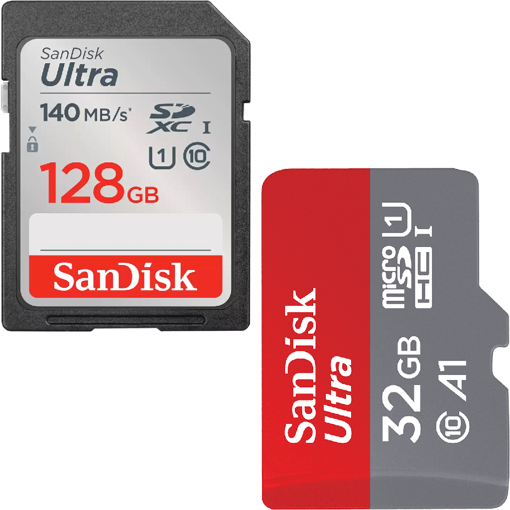

    
      
    This repository contains all the information and everything you need to know about what Motoplay is, how to use it and many other details. Read this page to understand everything about Motoplay.

# What is Motoplay?

Motoplay is a project that aims to bring an on-board computer to motorcycles. The main point is that this computer must be 100% functional, running Linux, for greater flexibility, and be able to interact with the vehicle's ECU to read information of motor and vehicle, have a media player and several other functions. Basically, this computer should work as a kind of "second panel", with Touchscreen input support, on the motorcycle's handlebars, so that the rider can count on several functions within reach of just a few touches.

The project is divided into two layers, the Hardware layer and the Software layer. The Hardware layer consists of all the accessories (peripherals) that will be installed on the motorcycle and that will be used by the on-board computer, such as speakers, 5v3a USB output, camera, etc.

In the second layer, in Software, we will have the Linux operating system, which will run the "Motoplay" software in full time, which is a program that will function as the on-board computer's central hub, being the key point for the pilot's use of the computer.

Of course, there are some mandatory Hardware accessories that need to be installed on your motorcycle if you intend to use Motoplay. All of these components are listed below. After that, there are some necessary procedures to prepare the computer and install the "Motoplay" program on the computer. All of this and many other details are all documented on this page, if you want to continue learning more, just keep reading!

[ INSERT-IMAGE ]

> [!WARNING]
> If you intend to use Motoplay, before we continue with this page... It is assumed that you already have prior knowledge regarding the use of the Linux System, Maintenance and Assembly of PCs, Experience With Installing Accessories on Motorcycles, and Knowledge About the OBD Interface of Vehicles. Keep in mind that if you are going to install accessories on your motorcycle, it is interesting that you already have prior knowledge and experience to do so.
> 
> You can create topics in the "Issues" tab of this repository, to ask questions, report problems or send suggestions! 🙂

# What Hardware do I need to have if I want to use Motoplay?

This topic will tell you all the Hardware you can buy to install on your motorcycle if you want to use Motoplay. Since there are many functions in Motoplay, not every function may be of interest of you, so the Hardware is divided into groups according to their functions. For each group, there is a Table below, informing you of the Hardware you need to have if you want to use the functions of the group.

Starting with the Computer group. Everything in this group is mandatory, and is necessary if you want to use Motoplay, as all the hardware in this group is directly connected to the central element of Motoplay, which is the on-board computer.

| Image                                        | Name                                  | Details                                                                                                                                                                                                                                                                                                                                                                                                                                                                                                                                                                                                                                                                                                                                                                                                                                                                                                                                                                                                                                                                                                                                                                                                                                                                                                                               | Mandatory |
| -------------------------------------------- | ------------------------------------- | ------------------------------------------------------------------------------------------------------------------------------------------------------------------------------------------------------------------------------------------------------------------------------------------------------------------------------------------------------------------------------------------------------------------------------------------------------------------------------------------------------------------------------------------------------------------------------------------------------------------------------------------------------------------------------------------------------------------------------------------------------------------------------------------------------------------------------------------------------------------------------------------------------------------------------------------------------------------------------------------------------------------------------------------------------------------------------------------------------------------------------------------------------------------------------------------------------------------------------------------------------------------------------------------------------------------------------------- | --------- |
|      | Raspberry Pi 4 Model B (or better)    | The Raspberry Pi is the hardware we will use as a computer due to its flexibility and practicality. It is an excellent piece of hardware that comes with a great Linux/Debian distro, which is Raspbian OS, in addition to having HDMI, P2, Gigabit, USB 2.0 and USB 3.0 ports, Bluetooth adapter and Wi-Fi. It is best if your Raspberry Pi is a 64-bit model, with at least 4GB of RAM and a 1.5 Ghz Quad-Core CPU. For this reason, the Raspberry Pi 4 Model B or any other newer or higher model is recommended.                                                                                                                                                                                                                                                                                                                                                                                                                                                                                                                                                                                                                                                                                                                                                                                                                  | Yes       |
|     | SD Card                               | The SD card works like an SSD for the Raspberry Pi. It is where you can save the system and all the files so that the Raspberry Pi can work. For best functionality and speed, a "SanDisk Ultra" or "SanDisk Extreme Pro" SD card of 32 GB or more is recommended.                                                                                                                                                                                                                                                                                                                                                                                                                                                                                                                                                                                                                                                                                                                                                                                                                                                                                                                                                                                                                                                                    | Yes       |
|  | SD Card Adapter                       | An SD Card to USB adapter will be crucial for you to be able to Read and Write data to your Raspberry Pi's SD Card using another computer. It is very useful for installing the operating system image onto the SD Card, and once everything is ready, just insert the SD Card into your Raspberry Pi. It is also very useful for using another computer to create Backup images of your SD Card. An adapter that supports USB 3.0 connection is recommended, as the USB 3.0 interface offers much higher Read and Write speeds than the USB 2.0 interface.                                                                                                                                                                                                                                                                                                                                                                                                                                                                                                                                                                                                                                                                                                                                                                           | Yes       |
|      | Screen With Touchscreen Input Support | The screen is an essential component of the on-board computer that we intend to assemble for use with Motoplay, so it is crucial that the screen has Touch support as this will be the best way to interact with Motoplay. The screen must have a minimum resolution of 480x320 pixels, however, the recommended resolution is 800x480. It is desirable that the screen has at least 50hz and is IPS for a more beautiful image, however, it is not mandatory. Regarding the interface for connecting the screen to the Raspberry Pi. There are several models of portable screens on the market, and each model uses a different connection method. The most common is usually using the Raspberry Pi's HDMI ports, but for this project, the best interfaces are DSI and GPIO. Screens that are connected to the Raspberry Pi's GPIO interface usually work well, but they usually have lower refresh rates and only turn on when the operating system has already started. Screens connected using the DSI interface are the most recommended for this project, as they usually have higher refresh rates and quality, in addition to behaving very similarly to HDMI screens, turning on from the moment the Raspberry Pi is powered on, so it is possible to follow the entire boot process, up to the operating system startup. | Yes       |

# Support projects like this

If you liked the Motoplay and found it useful for your, please consider making a donation (if possible). This would make it even more possible for me to create and continue to maintain projects like this, but if you cannot make a donation, it is still a pleasure for you to use it! Thanks! 😀

 

    

 

Created with ❤ by Marcos Tomaz

